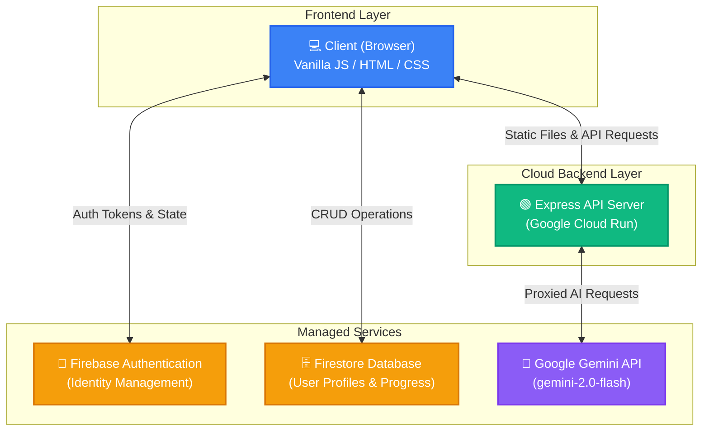
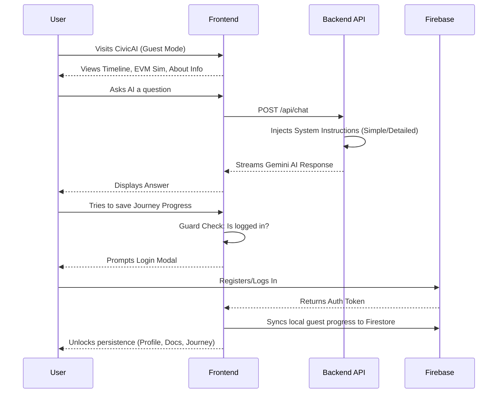

# CivicAI 🗳️ 

**Your Cloud-Native Indian Election Assistant**

CivicAI is an intelligent, scalable web application designed to empower Indian citizens with comprehensive election knowledge, personalized voter guidance, and a seamless digital experience. It helps users understand the electoral process, check their eligibility, simulate voting on an EVM, track important election timelines, and interact with a context-aware AI assistant.

---

## 🌟 Features

- **🤖 AI Election Assistant (Powered by Google Gemini):** A context-aware chatbot that answers questions about the Indian electoral process, EVMs, VVPAT, registration, and political history. Supports *Simple Mode* for beginners and *Detailed Mode* for deep-dives.
- **🗺️ Personalized Voter Journey:** A step-by-step interactive guide helping users track their voter registration process, from checking eligibility to finding their polling booth.
- **🗳️ Interactive EVM Simulation:** A visual simulation of the Electronic Voting Machine and VVPAT process to familiarize first-time voters with the physical voting experience.
- **⏰ Election Timeline:** A chronological tracker for upcoming state assembly and Lok Sabha elections across India.
- **🔐 Secure User Authentication:** Powered by Firebase, users can start exploring as guests and seamlessly register to persist their profile, checklists, and journey progress to the cloud.
- **📋 Document Manager:** A comprehensive checklist of required IDs and forms for new voter registration and voting day preparation.

---

## 🏗️ Architecture

CivicAI is built on a modern, serverless cloud architecture to ensure scalability and security. 

---

## 🚦 User Flow

Users can explore the app freely, but persistent features require an account.

---

## 🛠️ Tech Stack

- **Frontend:** Vanilla JavaScript, HTML5, CSS3 (No heavy UI frameworks, optimized for speed)
- **Backend:** Node.js, Express.js
- **Database:** Google Cloud Firestore (NoSQL)
- **Authentication:** Firebase Auth
- **AI Integration:** Google Generative AI (`gemini-2.0-flash`)
- **Deployment:** Google Cloud Run (Dockerized Serverless Container)

---

## 🚀 Setup & Local Development

1. **Clone the repository:**
   \`\`\`bash
   git clone https://github.com/A-Manojna/CivicAI.git
   cd CivicAI
   \`\`\`

2. **Install Dependencies:**
   \`\`\`bash
   npm install
   \`\`\`

3. **Configure Environment Variables:**
   Create a \`.env\` file in the root directory and add your Gemini API Key:
   \`\`\`env
   GEMINI_API_KEY=your_gemini_api_key_here
   \`\`\`

4. **Configure Firebase Admin:**
   Place your Firebase \`serviceAccountKey.json\` in the root directory. *(Note: Do not commit this file to version control).*

5. **Start the server:**
   \`\`\`bash
   npm start
   \`\`\`
   The app will run locally at \`http://localhost:8080\`.

---

*Made with ❤️ for India.*
